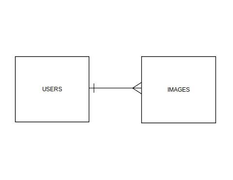

# Cagusabi Image Hosting API Repo!

# Connected Sites

-   Front-End Repo: <https://github.com/cagusabi/cagusabi-client>
-   Application:
-   Heroku Site:

# Technologies Used

-   Ajax
-   Atom
    -   open-source text and source code editor
-   AWS
-   Bootstrap
-   Express.js
-   CSS
-   Curl
-   HTML
-   Javascript
-   JQuery
-   JSon
-   MongoDB
-   Mongoose
-   Node.js
-   SCSS

### About the Back-End

### Development Process

### Reflections

### Future Goals

### Entity-Relationship-Diagram

